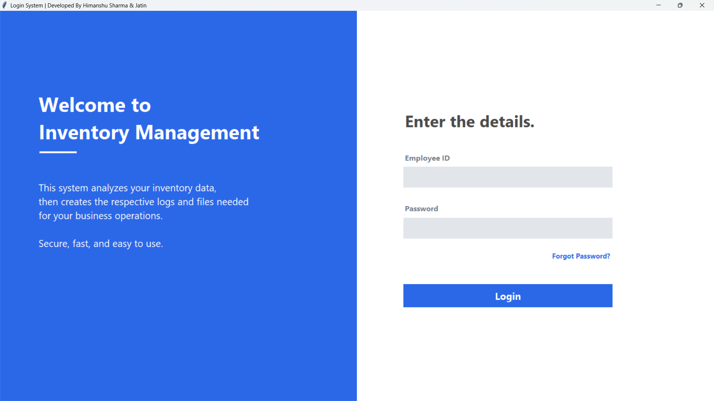
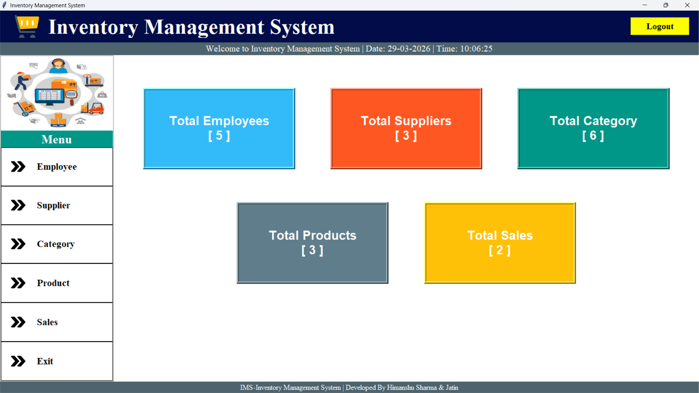
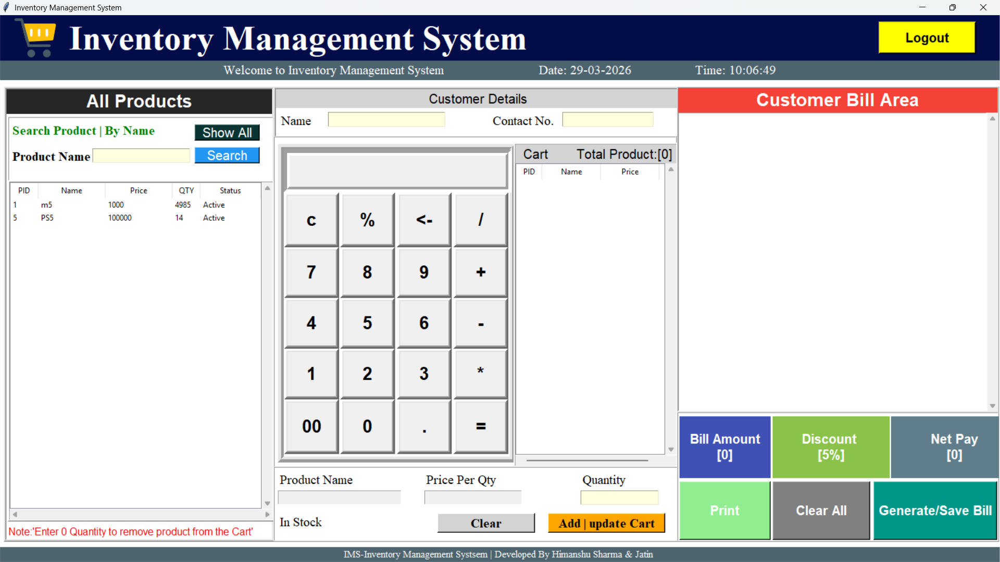

# 📦 Inventory Management System (IMS)

A complete, robust, and user-friendly Inventory Management System built with Python. This desktop application helps businesses track products, manage employees, handle suppliers, and generate sales bills efficiently.

## 🚀 Features

* **Secure Login System:** Authentication for authorized access.
* **Interactive Dashboard:** Real-time overview of inventory metrics.
* **Employee Management:** Add, update, delete, and view employee details.
* **Supplier & Category Management:** Organize product sources and types.
* **Product Tracking:** Manage stock levels, pricing, and availability.
* **Billing System:** Generate accurate sales bills and track past records.
* **Database Integration:** Secure local storage using SQLite3.

## 💻 Tech Stack Used

* **Language:** Python 3.x
* **GUI Framework:** Tkinter
* **Database:** SQLite3
* **Image Handling:** Pillow (PIL)

## 📸 Screenshots
### Login Page


### Dashboard


### Billing Page


## 🛠️ How to Run Locally

1. Clone the repository:
   ```bash
   git clone https://github.com/HimanshuSharma4/Inventory-Management-System.git
   ```
2. Install required dependencies:
    ```bash
    pip install pillow
    ```
3. Run the application:
    ```bash
   python login.py
   ```
*(Alternatively, Windows users can simply double-click the `run_ims.bat` file for a 1-click launch).*

---
**Developed with ❤️ by Himanshu Sharma & Jatin**